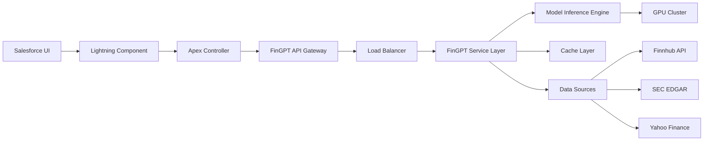

# Product Requirements Document (PRD)
# FinGPT Integration with Salesforce

## 1. Executive Summary

### 1.1 Purpose
This PRD outlines the integration of FinGPT's financial AI capabilities into Salesforce's CRM ecosystem, enabling Salesforce users to leverage advanced financial analysis, sentiment analysis, and predictive insights directly within their workflows.

### 1.2 Value Proposition
- **Enhanced Customer Intelligence**: Real-time financial sentiment analysis on customer communications
- **Predictive Sales Insights**: Stock price forecasting and market analysis for investment clients
- **Automated Financial Report Analysis**: Quick insights from 10-K reports and earnings calls
- **Intelligent Lead Scoring**: Financial health assessment of potential clients

## 2. Product Overview

### 2.1 Integration Scope
The integration will expose four core FinGPT capabilities within Salesforce:
1. **Financial Sentiment Analysis** - Analyze sentiment in financial communications
2. **Stock Price Forecasting** - Predict market movements for client portfolios
3. **Financial Report Analysis** - Extract insights from regulatory filings
4. **RAG-Enhanced Financial Q&A** - Answer complex financial queries with context

### 2.2 Target Users
- **Financial Advisors** using Salesforce Financial Services Cloud
- **Sales Teams** in investment banking and wealth management
- **Customer Service Representatives** handling financial products
- **Research Analysts** tracking market sentiment

## 3. Functional Requirements

### 3.1 Salesforce Integration Points

#### 3.1.1 Lightning Components
- **FinGPT Analysis Panel**: Embedded Lightning Web Component (LWC) in Account/Contact/Opportunity layouts
- **Sentiment Indicator**: Visual sentiment badges on Email/Chatter posts
- **Market Insights Dashboard**: Custom Lightning page with forecasting widgets

#### 3.1.2 Salesforce Objects Integration
```
Account
├── FinGPT_Sentiment_Score__c (Number)
├── FinGPT_Financial_Health__c (Picklist)
├── FinGPT_Last_Analysis_Date__c (DateTime)
└── FinGPT_Risk_Score__c (Number)

Opportunity
├── FinGPT_Deal_Sentiment__c (Text)
├── FinGPT_Market_Forecast__c (Rich Text)
└── FinGPT_Confidence_Score__c (Percent)

Email Message / Chatter Post
└── FinGPT_Sentiment__c (Picklist: Positive/Neutral/Negative)
```

#### 3.1.3 Apex Integration
```apex
// Example Apex class structure
public class FinGPTService {
    @AuraEnabled
    public static SentimentResult analyzeSentiment(String text);
    
    @AuraEnabled
    public static ForecastResult getForecast(String ticker, Integer weeks);
    
    @AuraEnabled
    public static ReportAnalysis analyzeFinancialReport(String reportUrl);
}
```

### 3.2 Core Features

#### 3.2.1 Sentiment Analysis Module
**Functionality**:
- Analyze emails, chatter posts, and notes for financial sentiment
- Real-time analysis triggered by record creation/update
- Batch analysis for historical data

**User Flow**:
1. User creates/receives email in Salesforce
2. FinGPT automatically analyzes content
3. Sentiment score displayed in email header
4. Aggregate sentiment tracked on Account level

#### 3.2.2 Stock Forecasting Module
**Functionality**:
- On-demand stock price predictions
- Configurable forecast periods (1-4 weeks)
- Integration with client portfolio data

**User Flow**:
1. User navigates to Account with stock holdings
2. Clicks "Generate Market Forecast"
3. FinGPT analyzes recent news and financials
4. Displays prediction with confidence intervals

#### 3.2.3 Financial Report Analyzer
**Functionality**:
- Upload and analyze 10-K, 10-Q, earnings transcripts
- Extract key metrics and insights
- Generate executive summaries

**User Flow**:
1. User uploads report to Salesforce Files
2. Triggers FinGPT analysis
3. Results stored in custom object
4. Summary displayed in Account timeline

#### 3.2.4 RAG-Enhanced Q&A
**Functionality**:
- Natural language queries about financial data
- Context-aware responses using customer data
- Integration with Salesforce Knowledge

**User Flow**:
1. User types question in FinGPT chat interface
2. System retrieves relevant context from CRM
3. FinGPT generates comprehensive answer
4. Response logged for compliance

### 3.3 API Architecture

#### 3.3.1 FinGPT API Gateway
```yaml
Base URL: https://api.fingpt-salesforce.com/v1

Endpoints:
  POST /sentiment/analyze
    Request:
      - text: string (required)
      - context: object (optional)
    Response:
      - sentiment: enum [positive, neutral, negative]
      - confidence: float [0-1]
      - reasoning: string
      
  POST /forecast/predict
    Request:
      - ticker: string (required)
      - weeks: integer [1-4]
      - include_fundamentals: boolean
    Response:
      - prediction: enum [up, down, neutral]
      - percentage_change: float
      - analysis: object
      
  POST /reports/analyze
    Request:
      - document_url: string
      - analysis_type: enum [summary, metrics, risks]
    Response:
      - job_id: string
      - status: enum [queued, processing, completed]
      
  POST /rag/query
    Request:
      - question: string
      - context_ids: array[string]
      - max_tokens: integer
    Response:
      - answer: string
      - sources: array[object]
      - confidence: float
```

#### 3.3.2 Authentication & Security
- **OAuth 2.0** for Salesforce Connected App
- **API Key** authentication for FinGPT services
- **Field-Level Encryption** for sensitive financial data
- **IP Whitelisting** for production environments

### 3.4 Data Flow Architecture



## 4. Non-Functional Requirements

### 4.1 Performance Requirements
- **Response Time**: 
  - Sentiment Analysis: < 2 seconds
  - Stock Forecast: < 5 seconds
  - Report Analysis: < 30 seconds (async)
- **Throughput**: 10,000 requests/hour
- **Availability**: 99.9% uptime SLA

### 4.2 Scalability
- **Horizontal Scaling**: Auto-scaling based on request volume
- **Model Serving**: Multiple model instances with load balancing
- **Caching Strategy**: Redis for frequent queries

### 4.3 Security & Compliance
- **Data Encryption**: TLS 1.3 in transit, AES-256 at rest
- **GDPR Compliance**: Data retention and deletion policies
- **SOC 2 Type II** certification required
- **Financial Regulations**: FINRA, SEC compliance

### 4.4 Data Governance
- **Data Residency**: Configurable by region
- **Audit Logging**: All API calls logged
- **PII Handling**: Automatic redaction of sensitive info

## 5. Technical Architecture

### 5.1 Infrastructure Requirements
```yaml
Production Environment:
  API Gateway:
    - AWS API Gateway or Azure API Management
    - Rate limiting: 100 requests/minute per org
    
  Compute:
    - Kubernetes cluster (EKS/AKS)
    - GPU nodes: 8x NVIDIA A100 for inference
    - CPU nodes: 16x for API services
    
  Storage:
    - PostgreSQL for metadata
    - S3/Blob for document storage
    - Redis for caching
    
  Monitoring:
    - Datadog/New Relic for APM
    - CloudWatch/Azure Monitor for infrastructure
    - Custom dashboards for model performance
```

### 5.2 Model Deployment Strategy
- **Blue-Green Deployment** for model updates
- **A/B Testing** framework for new models
- **Model Registry** for version control
- **Rollback Capability** within 5 minutes

## 6. Implementation Phases

### Phase 1: MVP (3 months)
- Sentiment Analysis for Emails/Chatter
- Basic Lightning Component
- Single-tenant deployment

### Phase 2: Enhanced Features (3 months)
- Stock Forecasting module
- Batch processing capabilities
- Multi-tenant architecture

### Phase 3: Advanced Integration (3 months)
- Financial Report Analysis
- RAG-enhanced Q&A
- Advanced analytics dashboard

### Phase 4: Enterprise Features (3 months)
- Custom model fine-tuning per org
- Advanced compliance features
- White-label options

## 7. Success Metrics

### 7.1 Adoption Metrics
- **MAU** (Monthly Active Users): Target 10,000 in Year 1
- **API Calls**: 1M+ monthly by end of Year 1
- **Feature Adoption**: 60% of users using 2+ features

### 7.2 Business Metrics
- **Customer Satisfaction**: NPS > 50
- **Time Savings**: 30% reduction in analysis time
- **Revenue Impact**: 15% increase in qualified leads

### 7.3 Technical Metrics
- **API Latency**: P95 < 3 seconds
- **Model Accuracy**: > 85% for sentiment analysis
- **System Uptime**: > 99.9%

## 8. Risks and Mitigation

### 8.1 Technical Risks
| Risk | Impact | Mitigation |
|------|--------|------------|
| Model hallucination | High | Implement confidence thresholds and human review |
| API rate limits | Medium | Implement caching and queue management |
| GPU availability | High | Multi-cloud deployment strategy |

### 8.2 Business Risks
| Risk | Impact | Mitigation |
|------|--------|------------|
| Regulatory changes | High | Regular compliance audits and legal review |
| Data quality issues | Medium | Data validation and cleansing pipeline |
| Competitor features | Medium | Continuous model improvement and feature development |

## 9. Pricing Model

### 9.1 Pricing Tiers
1. **Starter**: $500/month
   - 5,000 API calls
   - Sentiment analysis only
   - 5 users

2. **Professional**: $2,000/month
   - 25,000 API calls
   - All features
   - 25 users

3. **Enterprise**: Custom pricing
   - Unlimited API calls
   - Custom models
   - Unlimited users

### 9.2 Usage-Based Pricing
- Additional API calls: $0.10 per call
- Custom model training: $5,000 one-time
- Premium support: $1,000/month

## 10. Appendix

### 10.1 Sample API Requests

#### Sentiment Analysis
```json
POST /sentiment/analyze
{
  "text": "Apple's Q3 earnings exceeded expectations with record iPhone sales.",
  "context": {
    "account_id": "001xx000003DHP0",
    "source": "email"
  }
}

Response:
{
  "sentiment": "positive",
  "confidence": 0.92,
  "reasoning": "Earnings exceeding expectations and record sales indicate positive financial performance."
}
```

#### Stock Forecast
```json
POST /forecast/predict
{
  "ticker": "AAPL",
  "weeks": 2,
  "include_fundamentals": true
}

Response:
{
  "prediction": "up",
  "percentage_change": 3.5,
  "analysis": {
    "positive_factors": ["Strong Q3 earnings", "New product launch"],
    "negative_factors": ["Supply chain concerns"],
    "confidence_level": 0.78
  }
}
```

### 10.2 Salesforce Setup Guide
1. Install FinGPT managed package
2. Configure Connected App settings
3. Set up API credentials in Custom Settings
4. Assign permission sets to users
5. Add Lightning components to page layouts
6. Configure workflow rules for automation

### 10.3 Support and Documentation
- Developer Portal: https://developers.fingpt-salesforce.com
- API Documentation: https://api-docs.fingpt-salesforce.com
- Support: support@fingpt-salesforce.com
- SLA: https://sla.fingpt-salesforce.com